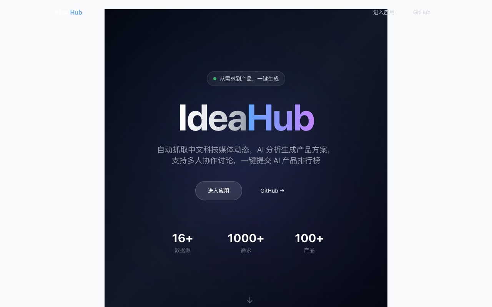
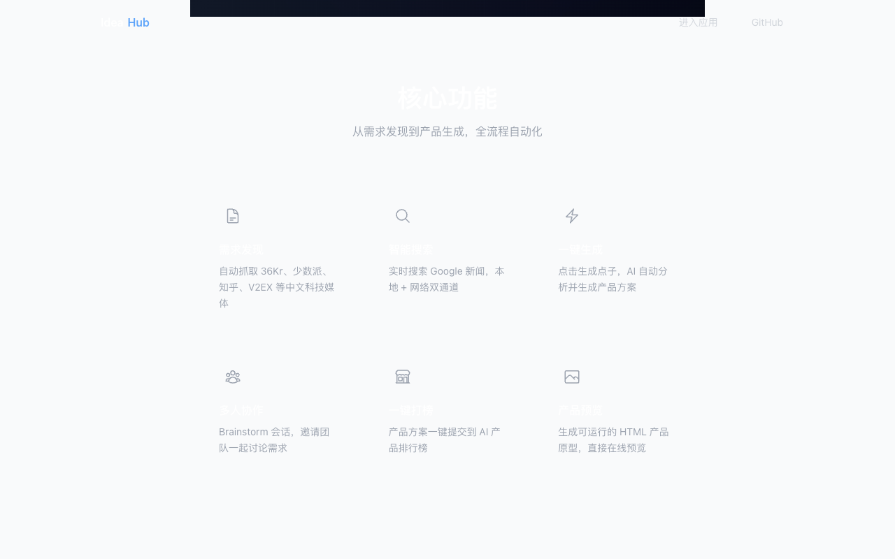
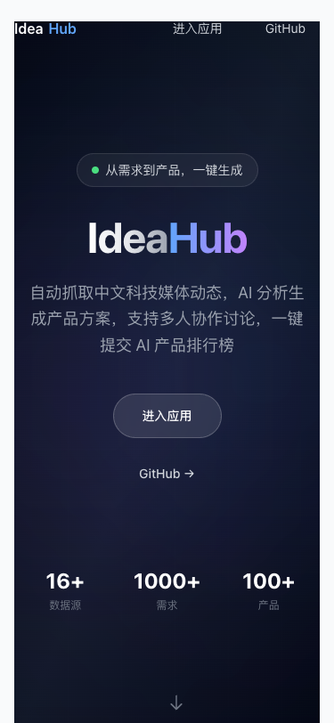
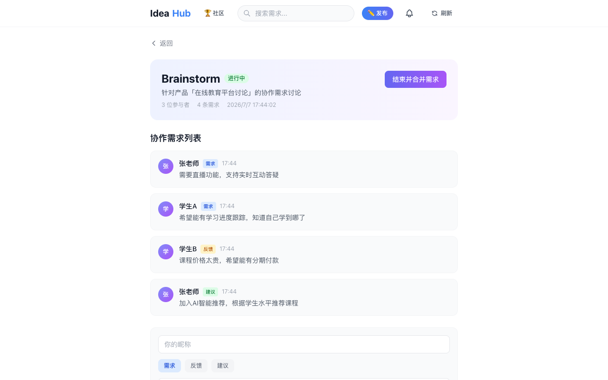

# IdeaHub

> 从需求到产品，一键生成

**在线体验：https://ideahub-pearl.vercel.app**

---

## 落地页

Web3 风格的产品宣传页，展示核心功能和技术栈。







---

## 首页 - 需求时间线

自动抓取中文科技媒体的最新动态，按时间线展示。点击标题跳转原文，点击「生成点子」直接开始分析。


---

## 移动端适配

支持手机、平板、桌面多设备访问。


---

## 搜索 - 实时检索

输入关键词，同时搜索本地缓存和 Google 新闻，快速找到相关内容。


---

## 社区 - 作品展示

所有已生成的产品方案在社区页面展示，支持投票和直接体验。


---

## Brainstorm - 多人协作

发起 Brainstorm 会话，邀请同学一起讨论需求，结束后合并生成产品文档。




---

## 功能特性

### 需求发现
- 自动抓取 36Kr、少数派、知乎、V2EX、掘金、GitHub Trending 等中文源
- 首次访问自动触发抓取，无需手动操作
- 按时间线展示，不聚合、不排序

### 智能搜索
- 输入关键词实时搜索 Google 新闻
- 本地缓存 + 网络搜索双通道
- 搜索结果可直接生成产品方案

### 一键生成
- 点击「生成点子」→ 自动搜索相关内容 → 分析生成产品方案
- 支持多次调整，保留版本历史
- 生成可运行的 HTML 产品原型

### 一键打榜
- 生成的产品可一键提交到 AI 产品排行榜（aicpb.com）
- 自动填充产品信息，只需填写联系邮箱

### Brainstorm 协作
- 发起讨论会话，邀请同学参与
- 收集需求、反馈、建议
- 合并讨论结果，重新生成产品方案

### 产品预览
- 生成的产品页面可直接在线预览
- 支持部署到公网，生成可分享链接

---

## 技术栈

| 层级 | 技术 |
|------|------|
| 前端 | Next.js 16 + React 18 + TypeScript + Tailwind CSS |
| AI | Agnes AI API（产品方案生成） |
| 搜索 | Google News RSS |
| 爬虫 | 原生 fetch + RSS 解析 |
| 存储 | JSONBlob |
| 部署 | Vercel |

---

## 快速开始

```bash
# 安装依赖
npm install

# 配置环境变量
cp .env.local.example .env.local
# 编辑 .env.local 填入 AGNES_API_KEY 和 JSONBLOB_ID

# 启动
npm run dev
```

## 环境变量

| 变量 | 说明 | 必填 |
|------|------|------|
| `AGNES_API_KEY` | Agnes AI API 密钥（产品方案生成） | 是 |
| `JSONBLOB_ID` | JSONBlob 存储 ID（数据持久化） | 否 |

## 部署

```bash
vercel --prod
```

## License

MIT
