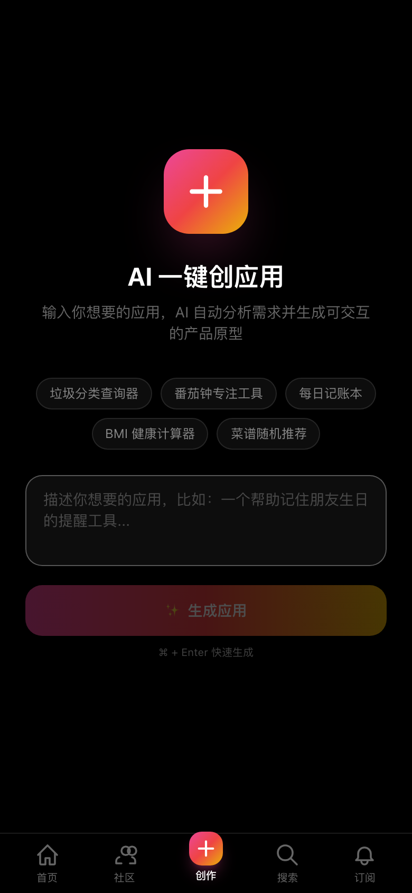
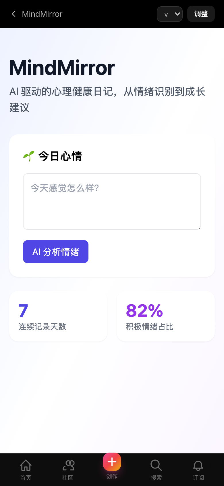
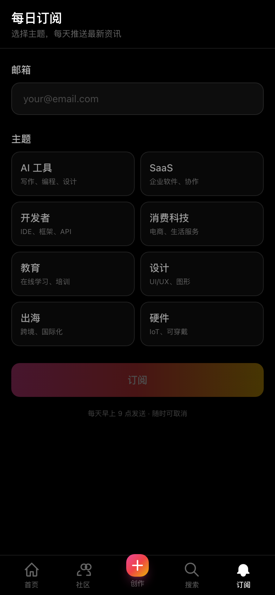

# IdeaHub · 刷网页的 TikTok

> 输入一句话想法，AI 60 秒生成可交互应用。上下滑动浏览，像刷抖音一样刷产品。

**🚀 在线体验：https://ideahub-pearl.vercel.app**

---

## ✨ 核心特性

- 🎬 **TikTok 式滑动浏览** — 全屏竖向卡片，上下滑动切换 AI 生成的应用
- ⚡ **一键创建** — 输入想法描述，AI 自动分析需求 → 设计方案 → 生成可交互 HTML 应用
- 🤖 **Agnes AI 驱动** — 全程使用 Agnes 免费 API，零成本端到端生成
- 📊 **社区排行** — 点赞投票，热门应用上榜
- 🔍 **智能搜索** — 关键词检索所有 AI 生成作品
- 📬 **主题订阅** — 选感兴趣的领域，每日推送精选
- 📱 **移动端优先** — 390×844 视口设计，触摸交互优化

---

## 📱 页面预览

### 首页 · 刷产品

全屏 TikTok 风格卡片，右侧操作栏（点赞/分享/全屏/详情），底部渐变信息区。


### 创作页 · 一键生成

输入想法 → AI 分阶段生成（分析需求 → 设计方案 → 生成应用 → 发布上线）→ 全屏预览成品。



### 社区 · 排行榜

所有 AI 生成应用按点赞数排名，点击卡片查看详情，点击爱心投票。


### 产品详情

展示产品方案（问题、解决方案、目标用户、核心功能、技术栈），可查看应用预览、发起 Brainstorm 协作。


### 应用预览

全屏查看 AI 生成的 HTML 应用，支持版本切换。



### 搜索 & 订阅

关键词搜索 + 标签快捷筛选；邮件订阅每日精选。




---

## 🛠 技术栈

| 层 | 技术 |
|---|---|
| 框架 | Next.js 14 (App Router) + TypeScript |
| 样式 | Tailwind CSS（黑色主题） |
| AI | Agnes AI `agnes-1.5-flash`（免费，256K 上下文） |
| 存储 | localStorage + jsonblob.com 远程备份 |
| 部署 | Vercel (Hobby) |
| 搜索 | DuckDuckGo |
| RSS | V2EX / HN / ProductHunt / Reddit / 36Kr / SSPAI / 知乎 / GitHub Trending |

---

## 🚀 本地开发

```bash
git clone https://github.com/vvlife/ideahub.git
cd ideahub
npm install
```

配置环境变量：

```bash
# .env.local
AGNES_API_KEY=your_agnes_api_key  # 从 https://agnes-ai.com 获取
```

启动开发服务器：

```bash
npm run dev
# 打开 http://localhost:3000
```

填充演示数据：

```bash
npm run seed
```

---

## 📖 创建流程

```
用户输入想法
    ↓
Agnes AI 分析需求 (agnes-1.5-flash, ~3s)
    ↓
生成产品方案 (名称/标语/问题/解决方案/核心功能/技术栈)
    ↓
Agnes AI 生成 HTML (agnes-1.5-flash, ~55s)
    ↓
保存到社区，出现在首页滑动流
    ↓
用户可点赞/分享/查看详情/发起协作
```

---

## 📂 项目结构

```
ideahub/
├── app/
│   ├── page.tsx                 # 首页 (TikTok 滑动流)
│   ├── create/page.tsx          # AI 一键创建
│   ├── community/page.tsx       # 社区排行
│   ├── search/page.tsx          # 搜索
│   ├── subscribe/page.tsx       # 订阅
│   ├── product/[id]/
│   │   ├── page.tsx             # 产品详情
│   │   └── app/page.tsx         # 应用全屏预览
│   └── api/
│       ├── create/route.ts      # AI 创建端点
│       ├── community/route.ts   # 社区列表
│       ├── search/route.ts      # 搜索
│       ├── vote/route.ts        # 投票
│       └── subscriptions/route.ts
├── components/
│   ├── swipe/
│   │   ├── SwipeFeed.tsx        # 滑动容器
│   │   └── AppCard.tsx          # 单个卡片
│   └── layout.tsx               # 底部导航栏
├── lib/
│   ├── remote-store.ts          # 远程存储
│   ├── rss-fetcher.ts           # RSS 抓取
│   ├── filter.ts                # 广告过滤
│   └── types.ts                 # 类型定义
└── scripts/
    └── seed.mjs                 # 演示数据
```

---

## 📝 License

MIT

---

## 🙏 Acknowledgements

- [Agnes AI](https://agnes-ai.com) — 免费全模态 API
- [Next.js](https://nextjs.org) — React 框架
- [Vercel](https://vercel.com) — 部署平台
- [Tailwind CSS](https://tailwindcss.com) — 样式系统
