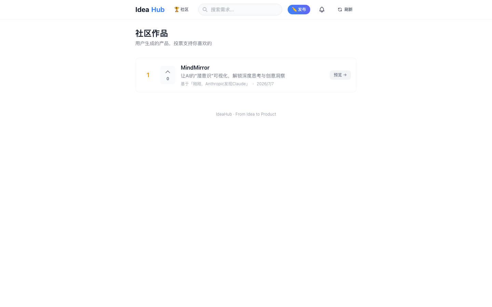
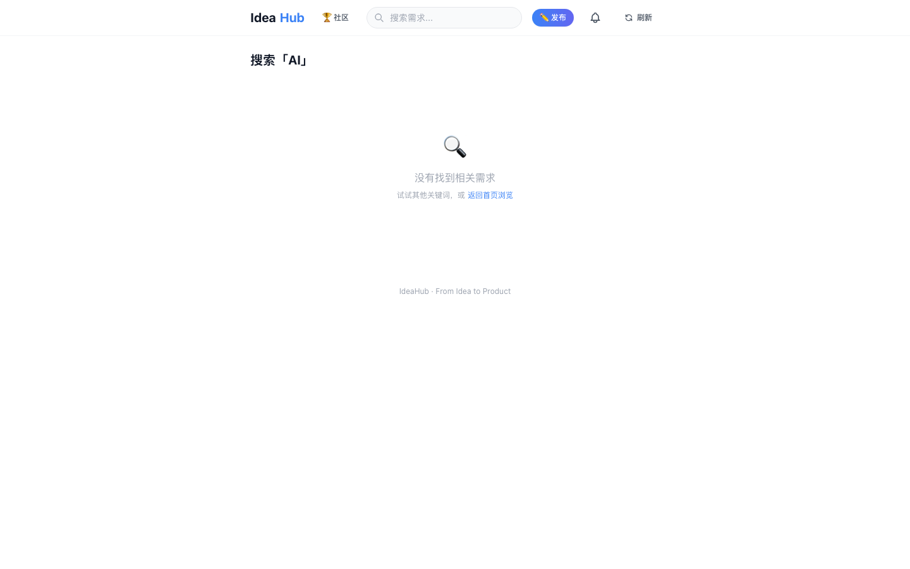
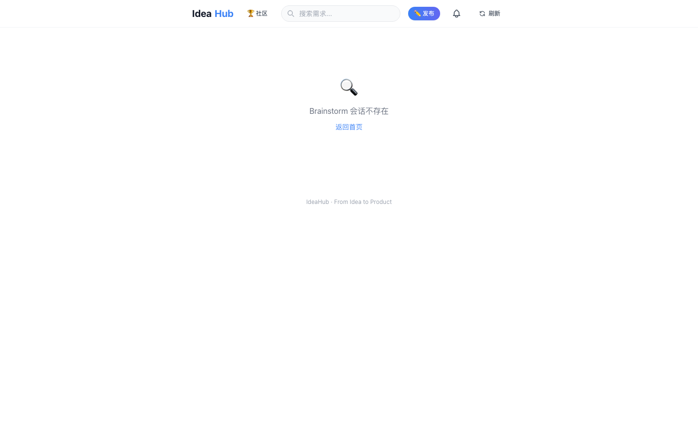

# IdeaHub

> From Idea to Product.

**在线体验：https://ideahub-lyart.vercel.app**

---

## 首页 - 需求发现

自动抓取 16 个来源的需求，支持用户手动发布。点击需求可直接进入 AI 分析。


---

## 社区展示 - 作品投票

Product Hunt 风格的作品展示页，用户可投票支持喜欢的产品。点击直接进入产品预览。



---

## 搜索 - 需求检索

支持关键词搜索需求标题、描述和分类。



---

## Brainstorm - 多人协作

发起 Brainstorm 会话，邀请同学一起讨论需求。支持添加需求、反馈、建议，结束后合并生成产品文档。



---

## 功能一览

### 需求发现
- **16 个来源并行抓取**：V2EX、HackerNews、ProductHunt、Reddit、GitHub Trending/Issues、Dev.to、IndieHackers、36Kr、SSPAI、Twitter、小红书、App Store 评论、PH 评论、微博、知乎
- **智能过滤**：自动过滤广告、代码 BUG、技术求助等非产品需求
- **用户发布**：支持手动发布需求，所有用户共享

### AI 产品生成
- **一键分析**：点击需求 → AI 自动生成产品方案（问题分析、解决方案、目标用户、核心功能、技术栈、商业模式、竞品分析、MVP 方案）
- **版本管理**：支持多次调整生成，保留完整版本历史
- **产品预览**：生成可运行的单文件 HTML 产品原型

### Brainstorm 协作
- **多人协作**：发起 Brainstorm 会话，邀请同学一起讨论
- **需求收集**：参与者提交需求、反馈、建议
- **合并生成**：结束讨论后，合并所有需求重新生成产品文档

### 产品部署
- **一键部署**：产品页面可部署到公网，生成可分享链接
- **实时预览**：iframe 沙箱预览产品效果

### 打榜提交
- **AICPB 提交**：一键提交到 AI 产品排行榜（aicpb.com）
- **自动填充**：产品信息自动填充，只需填写联系邮箱

### 社区展示
- **作品展示**：所有已生成的产品在社区页面展示
- **投票排序**：Product Hunt 风格的投票机制，每人每产品一票
- **点击体验**：直接跳转到产品预览页

---

## 技术栈

- **前端**：Next.js 14 (App Router) + React 18 + TypeScript + Tailwind CSS
- **后端**：Next.js API Routes + Vercel Serverless
- **存储**：JSONBlob（产品/需求数据）
- **AI**：Agnes AI API（产品方案生成）
- **爬虫**：原生 fetch + crawl4ai（可选，本地运行）
- **部署**：Vercel

---

## 快速开始

```bash
# 安装依赖
npm install

# 配置环境变量
cp .env.local.example .env.local
# 编辑 .env.local 填入 AGNES_API_KEY

# 启动开发服务器
npm run dev
```

## 环境变量

| 变量 | 说明 | 必填 |
|------|------|------|
| `AGNES_API_KEY` | Agnes AI API 密钥（用于产品方案生成） | 是 |
| `JSONBLOB_ID` | JSONBlob 存储 ID（用于持久化数据） | 否 |

## 部署

```bash
vercel --prod
```

## 本地开发（可选：crawl4ai 增强爬虫）

```bash
# 安装 Python 依赖
pip3 install crawl4ai fastapi uvicorn

# 启动 crawl4ai 服务
python3 crawl-server/server.py

# 另一个终端启动 Next.js
npm run dev
```

## License

MIT
